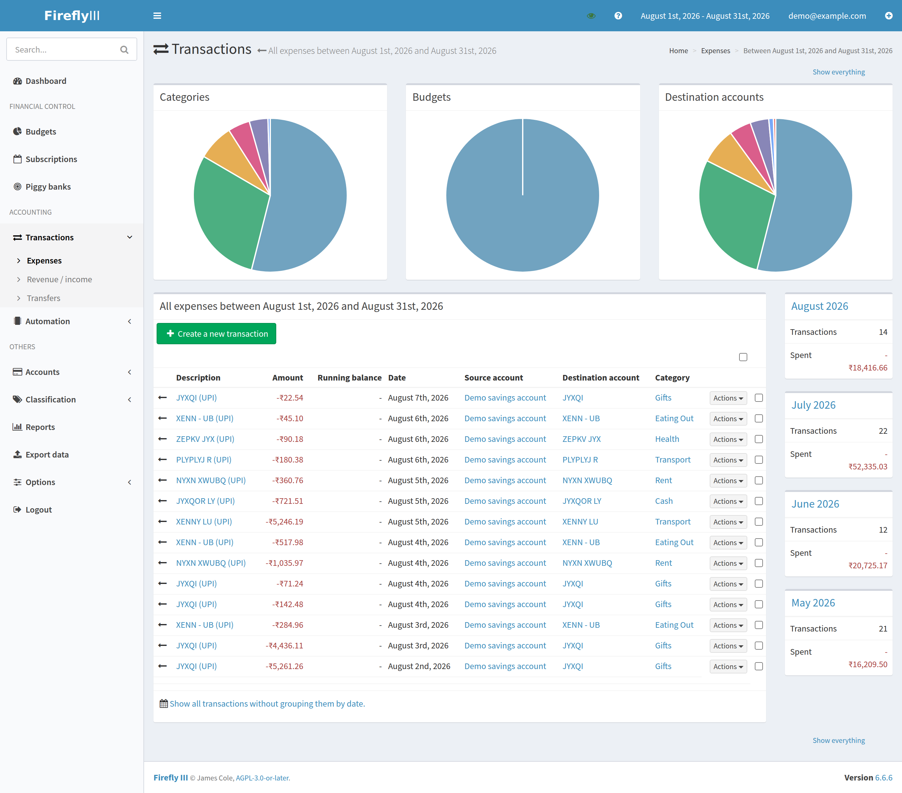

# passbook

[](https://github.com/shubh-garg18/passbook/actions/workflows/ci.yml)
[](https://github.com/shubh-garg18/passbook/stargazers)
[](https://github.com/shubh-garg18/passbook/network/members)
[](#is-it-for-you)

**Your bank statement, turned into a ledger that tells you the truth about your
spending.** Self-hosted, offline, and it takes one command to install.

> **New here, or not a developer?** → **[What is this?](docs/what-is-this.md)**
> — the whole idea in plain language, no jargon, two minutes.

Firefly III counts every withdrawal as spending. On a real three-month statement
that read **three times** what was actually spent — because moving money to your
own savings is not spending, and a refund is not income. passbook fixes that, and
shows you what it excluded instead of hiding it.


<sub>It reads the statement, categorises it, and pushes it into Firefly III,
which keeps the ledger:</sub>



<sub>Both generated from `tests/fixtures/statement.xls` — never a real ledger.</sub>

## Install

```bash
git clone https://github.com/shubh-garg18/passbook.git
cd passbook
make setup
```

**On Windows** there is no `make`, so the last line is
`python scripts\setup.py` instead — or double-click
`launchers\start-passbook.cmd`. Every other `make …` in the docs has a
one-line Windows equivalent, [listed here](SETUP.md#every-command-on-windows).

That is it. The wizard checks what Docker needs on *your* machine and offers to
fix it, generates every secret, starts the stack, creates your Firefly account
and API token, and reads your account number and opening balance out of the
statement itself.

It asks you three things: a Firefly login to create, a statement to read, and a
password. **[Full instructions →](SETUP.md)**

> **Using Claude Code?** Paste this and it does the whole thing:
> `Clone https://github.com/shubh-garg18/passbook.git and set it up by following its SETUP.md.`

Then everything happens at **http://localhost:8081** — upload, push, categories.
No terminal.

## Is it for you?

| | |
|---|---|
| ✅ | You want your own numbers, on your own machine, with nothing uploaded anywhere |
| ✅ | You are happy downloading a statement once a week |
| ✅ | **Canara, SBI and Union Bank** out of the box — and if yours is not one of them, *Account menu → Add a bank* reads your own file and takes the column mapping, on your laptop, with nothing sent anywhere |
| ⚠️ | Needs a PC (Windows, macOS or Linux). Not a phone |
| ❌ | You want automatic bank sync — India's Account Aggregator framework is closed to individuals, so nobody self-hosted can offer it |

## What makes it different

Most expense trackers show you a number. This one tries hard not to show you a
wrong number.

- **It checks itself against your statements.** A purge plus an interrupted
  re-push once left the ledger holding **21 of 93 rows with a self-consistent
  balance — and every check passed for seven hours.**
  [`verify-ledger`](docs/usage.md#is-the-ledger-still-right) exists because of
  that day.
- **It ships no merchant rules.** Banks truncate payee names to ~10 characters;
  of ten guessed from the fragment alone, **four were wrong**. A rule that never
  fires is worse than no rule, so
  [you write them from your real data](docs/usage.md#writing-categorisation-rules).
- **Money is `Decimal` everywhere**, including across the HTTP boundary. No
  floats touch your balance.
- **Backups are drilled, not assumed.** `make dr-drill` rebuilds the whole ledger
  from the encrypted archives on every run.

## Help wanted

Small, self-contained, and genuinely useful:

- **Say whether your bank worked.** *Account menu → Add a bank* maps your own
  file on your own machine — if it parsed, the profile it wrote is worth sharing
  so the next person gets it for free; if it did not, that is the most useful
  bug there is.
- **Try it and say what broke.** [Open an
  issue](https://github.com/shubh-garg18/passbook/issues) — a setup step that was
  wrong on your machine is the most useful bug there is.
- **Tell us it worked** in
  [Discussions](https://github.com/shubh-garg18/passbook/discussions), especially
  on macOS or a distro this has never run on.

⭐ **If this is useful, star it.** A star is the only signal this project can
receive: it runs entirely on your machine, it has never phoned home, and it never
will. There is no install counter and there is not going to be one.

## Docs

| | |
|---|---|
| [What is this?](docs/what-is-this.md) | the idea in plain language — start here if you are not a developer |
| [SETUP.md](SETUP.md) | install, first run, signing in, when it breaks |
| [Usage](docs/usage.md) | the weekly cycle, rules, checking the ledger, more than one account |
| [Backups](docs/backups.md) | `make backup`, off-site, the recovery runbook |
| [Operations](docs/operations.md) | what runs, the threat model, tests |
| [Contributing](CONTRIBUTING.md) · [SPEC](DECISIONS.md) | house rules, and every decision with the measurement behind it |

## Licence

**None yet — all rights reserved.** No open-source licence is granted, so you may
read this code but not legally copy, modify, fork or redistribute it. If you want
to use it or build on it, [open an
issue](https://github.com/shubh-garg18/passbook/issues) and ask.

The three bundled fonts are separate: they are SIL Open Font License 1.1, and
their licence ships beside them in
[`frontend/src/fonts/OFL.txt`](frontend/src/fonts/OFL.txt) as that licence
requires.

---

Built by **Shubh Garg** ([Bitwise](https://github.com/shubh-garg18)) ·
[github.com/shubh-garg18/passbook](https://github.com/shubh-garg18/passbook)
