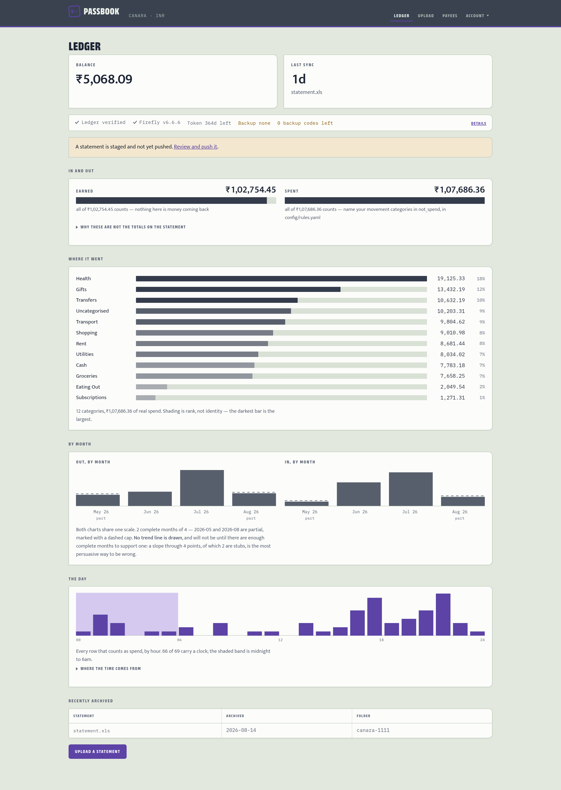

# passbook

Turns your weekly bank statement download into a categorised, queryable ledger
in a self-hosted [Firefly III](https://www.firefly-iii.org/).

You download the statement. passbook parses it, works out who each payment went
to, pushes it into Firefly, and shows you what you actually spent — as opposed
to what a naive total says you spent, which on a real ledger was **three times
higher**.

**Everything runs on your own machine.** No account, no cloud, no third party
ever sees a transaction. Every port is bound to `127.0.0.1`.

[Set up](docs/setup.md) · [Upgrading](docs/upgrading.md) ·
[Add your bank](docs/adding-a-bank.md) · [Contributing](CONTRIBUTING.md) ·
[Security](SECURITY.md)

---

## Read this before you get excited

**It supports Canara Bank today, and nothing else.** The parser is built around
one bank's export format, verified against a real three-month statement. Other
banks are a new file, not a rewrite —
[`docs/adding-a-bank.md`](docs/adding-a-bank.md) is the whole job, and it needs
neither Docker nor a Firefly instance to write.

**You need a PC.** Windows, macOS or Linux, with about 3 GB of disk free. **This
does not run on a phone or a tablet**, and there is no hosted version.

**The download is manual, every week, and it always will be.** You log into net
banking, download the statement, drop it on the upload page. There is no
auto-sync and no plan for one:

- India's **Account Aggregator** framework — the sanctioned way to get bank data
  programmatically — is restricted to registered Financial Information Users.
  Regulated entities only. An individual cannot get access, however much of
  their own data they are asking for.
- **Plaid and GoCardless do not cover Indian retail banks.** Firefly's own
  GoCardless import is EEA-only and closed to new customers.
- **Scraping net banking** breaks constantly and violates the bank's terms.

So this project does the honest thing instead: it makes the manual step small,
and it checks whether you actually did it. It cannot remind you — set a weekly
calendar entry. It will tell you how long it has been, on `make up`, on
`make sync` and in `passbook doctor`.

**Skip too many weeks and you lose data.** Banks only serve statements going
back so far. Rows that age out of the download window are gone from every copy
you hold, and no backup brings them back — only the bank has them, and not
forever. That is why the staleness warning escalates rather than nagging gently.

---

## What it does

| Page | What it shows |
|---|---|
| **Ledger** | balance, last sync, an integrity strip, and five charts |
| **Upload** | magic-byte check, size, continuity, the account assertion — then a preview. Pushes nothing |
| **Preview** | every row in sheet order with a running balance, and the Day Rail |
| **Payees** | every token with its alias, category, totals and hour-of-day spread; undecided first |



*Also in [dark](docs/screenshots/ledger-dark.png), and here is
[Payees](docs/screenshots/payees.png).*

*Every figure above comes from `tests/fixtures/statement.xls`, pushed into a
scratch Firefly that has never seen a real transaction — see
[docs/screenshots/](docs/screenshots/README.md). The categories are invented and
assigned round-robin; passbook ships none, for the reason in the rules section
below. "0 backup codes left" is the throwaway credential the screenshot harness
injects, not a real account.*

The signature element is the **Day Rail**: a 24-hour track with midnight–6am
shaded, one tick per transaction. The bank gives no time column, but the UPI
narration embeds one — 85 of 93 rows in the reference statement — and that is
the only reason a day canteen and a night canteen are separable at all. Rows
without a clock show a dashed empty track, never midnight, which would invent a
transaction that did not happen.

### Why the numbers are not just sums

Firefly counts **every withdrawal as spend and every deposit as income, by
type**. Measured on one real three-month ledger, read that way it said **three
times** the true spend and **1.6 times** the true earnings.

That is not a rounding error, and a chart drawn on the naive numbers looks
entirely reasonable. So:

- **Money moving is not money leaving.** Investments, transfers between your own
  accounts, credit-card payments and penny-drop verifications are excluded from
  spend. The list is `not_spend` in your own `config/rules.yaml`, so it is yours
  to edit.
- **Money coming back is not money earned.** Family support, repayments, refunds
  and verifications carry a `not-earnings` tag, so earnings are salary and
  interest and nothing else.

Every figure on every page goes through one function that applies both rules,
and each chart **draws what it excluded** — hatched, beside what it counted —
rather than leaving you to wonder where the rest went.

---

## Setup

Full walkthrough in [`docs/setup.md`](docs/setup.md). The short version:

1. Install [Docker Desktop](https://docs.docker.com/desktop/) and start it.
2. Install [Python 3.11 or newer](https://www.python.org/downloads/).
3. Clone this repository:
   ```bash
   git clone https://github.com/shubh-garg18/passbook.git
   cd passbook
   ```
4. Double-click the launcher for your system, or run `make setup`:

| | |
|---|---|
| Windows | `start-passbook.cmd` |
| macOS | `start-passbook.command` (first time: right-click → **Open**) |
| Linux | `./start-passbook.sh` |

The wizard checks what is missing, generates your secrets, starts the stack,
walks you to Firefly's API token page, **validates the token by using it**, and
sets a password for the UI. It is re-runnable and never overwrites a secret.

To see what is missing without changing anything:

```bash
make preflight        # or: python3 scripts/preflight.py
```

### The two things that go wrong

**The token.** In Firefly it is **Options → Remote access and tokens** →
Personal Access Tokens. *Not* the "Command line token" on the Profile page —
that is a different credential, it will not authenticate the API, and it is the
most common way to lose an hour here. A real one is a JWT: roughly a thousand
characters, starts `eyJ`, two dots in it. It expires after **365 days** with no
warning from Firefly; `passbook doctor` decodes the date locally and warns 30
days out.

**The opening balance.** When you create the asset account in Firefly, its
opening balance must be your statement's **opening** balance, dated on or before
the first transaction. Firefly's wizard invites you to enter your *current*
balance instead, which counts the closing figure twice and leaves the account
negative.

---

## The weekly cycle

**In a browser** — http://localhost:8081 → Upload → check the preview → Push.

**Or in a terminal:**

```bash
# 1. download the statement from net banking into inbox/   (manual)
uv run passbook doctor          # 2. token alive? right account?
uv run passbook sync            # 3. push, then archive on success
```

Both call the same code. There is one parser, one push path, one balance check.

`sync` is safely re-runnable. A file is archived **only** after a successful
push; a failure leaves it in `inbox/` and exits non-zero. Because weekly
downloads overlap, most rows on a second run are rejected as duplicates — that
is deduplication working, not a fault. A run reporting `pushed 0, duplicates 93`
is a correct outcome, and the two are counted separately so you can tell at a
glance.

### Is the ledger still right?

```bash
uv run passbook verify-ledger      # exit 7 if not; `doctor` runs the same checks
```

Five checks: Firefly's balance equals the newest statement's closing balance;
the live transaction ids equal what is in `archive/`; no soft-deleted rows; no
unfinished purge; the opening balance is present and carries no id. Failures
name the figure and the drift, not just "mismatch".

**Why this exists.** A purge plus an interrupted re-push once left the ledger
holding **21 of 93 rows** with a *self-consistent* balance. Every check that
existed passed for seven hours. The continuity invariant validates a statement
*file* at parse time; nothing validated Firefly. This is the check that catches
that corruption whatever caused it — an interrupted purge, a row deleted by hand
in Firefly's own UI, a restore of the wrong dump.

One of the five needs a database query the API cannot answer, so the web UI
reports that one as **unverified**, in amber, rather than green. A tick for
something never checked is a lie.

### Writing categorisation rules

```bash
make payees FILE=archive/canara-1111/2026-08/statement.xls
```

That ranks the payee tokens by frequency and total value. Write
`config/rules.yaml` against what it prints.

**Do not write rules against full merchant names.** Canara truncates the UPI
counterparty to about ten characters, so even a real merchant arrives as a
nine-character stub and a rule matching `Google Pay` silently never fires. Match
prefixes.

passbook ships **no merchant rules at all**, deliberately. Of ten tokens the
author tried to identify from the fragment alone, **four were wrong** — a token
reading like a restaurant was a clothing shop; one reading like a person's name
was a fast-food franchise. Ten characters is not enough information to
categorise on, and a shipped guess that never fires creates false confidence
that categorisation is working. The three rules that do ship are bank charges,
interest income, and a large-one-off tag.

Most of the traffic on a real statement is person-to-person UPI, so most of your
rules will be about people rather than merchants.

### Updating

```bash
git pull
make upgrade
```

`make upgrade` reports what is pending, **takes a database dump first**, applies
migrations in order, and records nothing unless the ledger verifies afterwards.
Run it after every pull; it is a no-op when nothing is pending.
[Details](docs/upgrading.md).

### More than one account

The first statement you upload registers its own account, so a single-account
setup needs no configuration and never mentions the feature. A second is
deliberate:

```bash
uv run passbook accounts add inbox/second-statement.xls
```

Why it has to be: Canara's transaction id is `YYYYMMDD` plus a per-date ordinal,
**sequenced per account** — so a second Canara account emits the *same ids*.
Every pushed row carries `<slug>-<id>` instead. Aliases and rules stay shared
across accounts, because the same person's payees are the same whichever account
paid them. Statements archive per account, because the bank names every export
for a date range identically and the second would overwrite the first.

---

## Backups

```bash
make backup           # database dump + config tarball -> backups/
make verify-backup    # prove the newest one restores, in a throwaway container
make backup-remote    # encrypt both and push off-machine via rclone
make dr-drill         # rebuild the ledger from the encrypted archives alone
```

Two artefacts, because they hold different things. Firefly's rules live in the
database and come back with the dump. **Your aliases do not** — they are applied
at push time and never stored server-side, so `payee_aliases.yaml` is the only
copy of the token→name mapping anywhere, and it is gitignored because it names
real people.

**A dump nobody has restored is a file, not a backup.** `make verify-backup`
loads it into a throwaway Postgres container and checks the ledger reconstructs
— row count, distinct ids, balance and earnings, compared against live. It never
touches your database. It is negative-tested against a corrupt gzip stream *and*
against an intact-looking truncated dump; a verifier that cannot fail proves
nothing.

`make backup-remote` encrypts with GPG AES256 **before** anything leaves the
machine, so the remote holds ciphertext only, and byte-compares every archive
against its plaintext before upload.

> ### Losing the passphrase loses the backups
>
> There is no recovery path and nobody to ask. Put it in a password manager the
> moment you create it. Create it only with `make backup-passphrase`, which
> refuses to overwrite an existing one — overwriting is as bad as losing it and
> much quieter, because the archives simply stop opening, with no error
> anywhere.

`make dr-drill` proves the whole recovery path end to end on every invocation:
it rebuilds the ledger from the encrypted archives and the passphrase alone, on
its own docker network, never touching the live stack. The source repository
rides inside the config tarball as a `git bundle`, so GitHub is a convenience
rather than a dependency.

---

## Signing in

The web UI has its own password and a mandatory second factor. On first sign-in
the browser walks you through enrolment: scan the QR, type one code back, and
you are shown **eight backup codes exactly once**. Write them down somewhere
that is not this machine — they are stored only as salted digests and nobody,
including this app, can print them again.

```bash
make web-password                # set or reset the password; KEEPS your TOTP
make web-totp                    # enrolled? how many backup codes left?
make web-totp RESET=yes          # phone gone and backup codes used up
make web-totp FORGET_DEVICES=yes # revoke every remembered browser
```

There is **no password reset and no email**, deliberately: both mean storing
another credential for a single-operator tool on one machine. Three doors back
in — a backup code, a TOTP reset from the host, or a password reset that leaves
the second factor alone.

**Why a password on a localhost-only service:** access over Tailscale is a
planned feature, and at that point localhost stops being the security boundary.
Auth added afterwards is auth that never gets added.

---

## What runs

| Service | Image | Exposure |
|---|---|---|
| `app` | `fireflyiii/core:version-6.6.6` | `127.0.0.1:8080`, settable via `FIREFLY_HOST_PORT` |
| `db` | `postgres:16-alpine` | none — not published to the host |
| `web` | built from this repository | `127.0.0.1:8081` |
| `caddy` | `caddy:2.8-alpine` | `127.0.0.1:80` — `passbook.localhost`, `khata.localhost` |

Two named volumes hold everything, and `make down` leaves both intact — which is
why `make down && make up` keeps your data.

> **`docker compose down -v` deletes the ledger.** The `-v` removes the volumes.
> There is deliberately no `make` target for it.

No cron container — nothing scheduled is reliable on a machine that sleeps, and
a scheduler that silently stops running is worse than none. No data-importer
container either; this pushes over the REST API instead.

---

## Security, honestly

Built for one person on one machine. It assumes that.

- **No HTTPS, and no auth beyond the UI's own.** Everything binds `127.0.0.1`.
  Do not expose it without putting a reverse proxy in front of it first.
- **Anyone with a shell on this machine has already won.** `.env` holds the
  Firefly token and the database password; `backups/` holds plaintext financial
  history. That is a stated design point rather than an oversight — but it means
  a lost machine is a lost ledger unless you have run `make backup-remote`.
- **`.env`, `inbox/`, `archive/`, `backups/` and your real `config/*.yaml` are
  gitignored, and must stay that way.**
- **Never upload a statement to an online converter.** It carries your account
  number, your customer ID, your full postal address, your IFSC, counterparty
  phone and account numbers, and your entire balance history. This is the one
  prohibition in this project with no exceptions.
- **Do not change `APP_KEY` after first login.** Firefly encrypts its API
  keypair with it, and a new key invalidates every existing token permanently.

Found a vulnerability? [`SECURITY.md`](SECURITY.md) — privately, please.

---

## Tests

```bash
make test          # fixtures only: no network, no Docker, no bank account
make audit-docs    # tracked docs must cite fixture values, never a real ledger
```

Fixtures live in `tests/fixtures/` and are generated by `scripts/redact.py` from
a real statement. The redaction rewrites the sheet name, the whole metadata
block, every narration and every amount — then **recomputes the balance chain**,
so the continuity invariant still holds on the fixture and the test exercising
it stays meaningful rather than tautological. Fake names keep the original
string lengths, so the ~10-character truncation signature survives.

Four containers come out of one redacted grid — `.xls`, `.csv`, `.html` and a
`.pdf` rendered and encrypted exactly as the bank's is — which is why the
PDF-versus-XLS cross-validation runs on a fresh clone instead of skipping.

---

## Licence

**AGPL-3.0-or-later.** See [`LICENSE`](LICENSE) and [`NOTICE.md`](NOTICE.md).

Firefly III is AGPL-3.0 as well, but its licence does not reach this code:
passbook speaks HTTP to an unmodified official image and never links, copies,
patches or redistributes any Firefly source, so §13's *"if you modify the
Program"* trigger never fires. AGPL was chosen anyway — it matches the
ecosystem, and it closes the one hole that actually matters here: someone
running this as a hosted service holding other people's bank statements and
giving nothing back. Running it on your own machine for yourself triggers no
obligation at all. The full reasoning is in SPEC §22.3.

## Documentation

| | |
|---|---|
| [`docs/setup.md`](docs/setup.md) | installing, and the two things that go wrong |
| [`docs/upgrading.md`](docs/upgrading.md) | `make upgrade`, and how to write a migration |
| [`docs/adding-a-bank.md`](docs/adding-a-bank.md) | supporting your bank, start to finish |
| [`CONTRIBUTING.md`](CONTRIBUTING.md) | house style, and the two non-negotiable rules |
| [`SPEC.md`](SPEC.md) | what gets built and why — every decision, with its measurement |
| [`CLAUDE.md`](CLAUDE.md) | how to work in this repository |

`SPEC.md` is long and unusually specific, because almost every number in it came
from running something rather than from assuming it. If you want to know why a
decision was made, it is in there.
