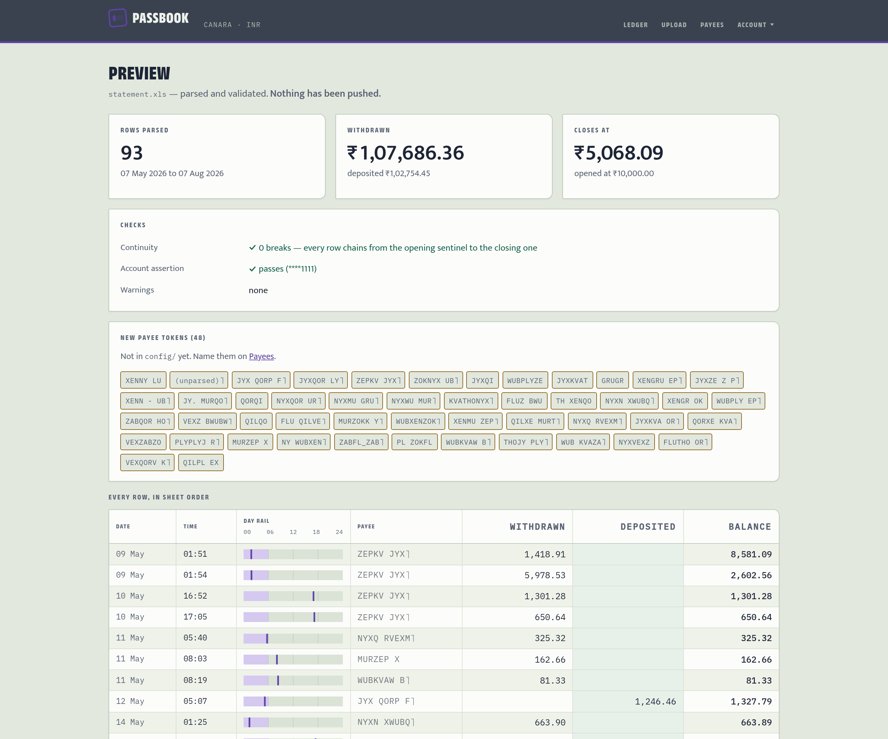

# What is this?

[← README](../README.md) · **What is this?** · [Setup](../SETUP.md) · [Usage](usage.md) · [Backups](backups.md) · [Operations](operations.md)

A plain explanation. No technical words, nothing you need to know beforehand.

---

## The problem

- Your bank tells you your **balance**. It does not tell you the **story**.
- You can see how much left your account last month. You cannot easily see that
  a fifth of it was food and a third was rent.
- Scrolling the bank's app tells you about *today*. It is very bad at telling you
  about *the last three months*.
- So most people have a rough feeling about their spending, and the feeling is
  usually wrong.

## What passbook does

Think of it as **a bookkeeper who reads your bank statement for you.**

- Once a week you download your statement from your bank — the same file you
  could open in Excel.
- You drop it into passbook.
- It reads every line, works out who each payment went to, and files it under a
  heading: food, rent, travel, whatever headings you decide on.
- It keeps a running record, so after a few weeks you can see where your money
  actually goes.

That is it. It is a filing clerk, not an adviser. It never moves your money,
never talks to your bank, and never tells you what to do.

This is what you end up looking at — where the money went, when in the day it
went, and how the months compare:

## The one idea worth understanding

**Money moving is not money spent.**

- If you take money out of your wallet and put it in a drawer, you have not
  spent it. You have moved it.
- Banks cannot tell the difference. Every rupee that leaves the account looks
  identical to them — savings transfers, money sent to yourself, a credit card
  bill you already counted.
- Add all of that up and the number looks alarming and means nothing.

On one real three-month statement, counting it the naive way said **three times**
more spending than had actually happened.

The same trap runs the other way:

- A refund is not income. Getting change back from a shop does not make you
  richer.
- Money a friend repays you is not earnings.

passbook separates the two, and — this matters — **it shows you what it set
aside** rather than quietly dropping it. You can always see the full number and
the honest one side by side.

## What a week looks like

**1.** Log into your bank and download the statement. *(Two minutes. This is the
only fiddly bit.)*

**2.** Open passbook in your browser and pick the file:

**3.** It reads the file and shows you what it found — **and saves nothing yet.**
How many transactions, which dates, whether the running balance adds up, and any
names it has not seen before:

Notice the middle box — *"0 breaks — every row chains from the opening sentinel
to the closing one"*. That is it checking the maths of your own statement,
line by line, before it trusts it. If a single row did not add up it would
refuse.

**4.** If it looks right, you click Push. Now it is saved.

That is the whole routine. The first time takes longer, because you tell it what
your regular payees are — "this one is the chemist", "this one is my landlord" —
and after that it remembers.

## Why you have to download the file yourself

- In India there is no legal way for a personal tool to read your bank account
  directly. The official system for that is open only to registered financial
  companies, not to individuals.
- Anything that claims otherwise is either asking for your net-banking password —
  never give that to anything — or is a company that has to see your data.
- So passbook does the honest thing: **you** fetch the file, **it** does the
  tedious part.

## Where the record actually lives

passbook does the reading and sorting. The record itself is kept by a separate,
well-established program called **Firefly III**, which installs alongside it.
You do not have to learn it — but it is there if you ever want to search, edit a
single entry, or take your data elsewhere:

Two programs rather than one, for a plain reason: keeping accounts properly is a
solved problem, and reinventing it badly would be the easiest way to get your
numbers wrong.

## Where your information lives

- On your own computer. Nowhere else.
- Nothing is uploaded, no account is created with anyone, no company sees your
  transactions — including whoever wrote this.
- If you unplug your internet, it still works.
- The trade-off is real and worth knowing: **if your computer dies and you have
  no backup, the record is gone.** passbook can make backups; you have to set
  that up.

## What it will not do

- ❌ Move money, pay bills, or touch your account in any way
- ❌ Give you investment or tax advice
- ❌ Work on a phone — it needs a computer
- ❌ Update by itself — you download the statement each week
- ❌ Guess what a payment was for. If it doesn't know, it says so and asks you

That last one is deliberate. Your bank shortens the other person's name to about
ten letters, and ten letters is not enough to guess from. Somebody tried
identifying ten of them by eye and **got four wrong** — so passbook asks you
instead of pretending.

## Words you will see

| Word | What it means |
|---|---|
| **Statement** | The list of everything that went in and out, downloaded from your bank |
| **Transaction** | One line on that list — one payment in or out |
| **Payee** | The person or shop the money went to |
| **Category** | The heading you file it under: food, rent, travel |
| **Balance** | How much is in the account |
| **Ledger** | The organised record passbook builds — the point of the whole thing |

## Is it for me?

**Probably yes if** — you want to know where your money goes, you are willing to
spend two minutes a week downloading a file, and you would rather your bank
details stayed on your own machine.

**Probably not if** — you want it to sync automatically, you only have a phone,
or you would rather use an app that does everything for you and holds your data.

---

Ready? → **[How to install it](../SETUP.md)** · Back to the
[overview](../README.md)
