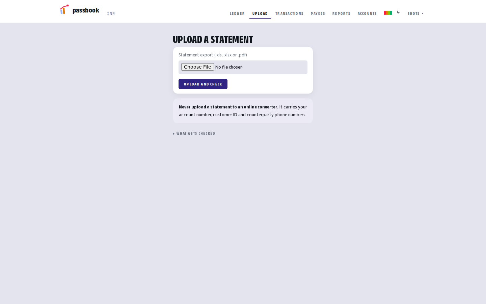
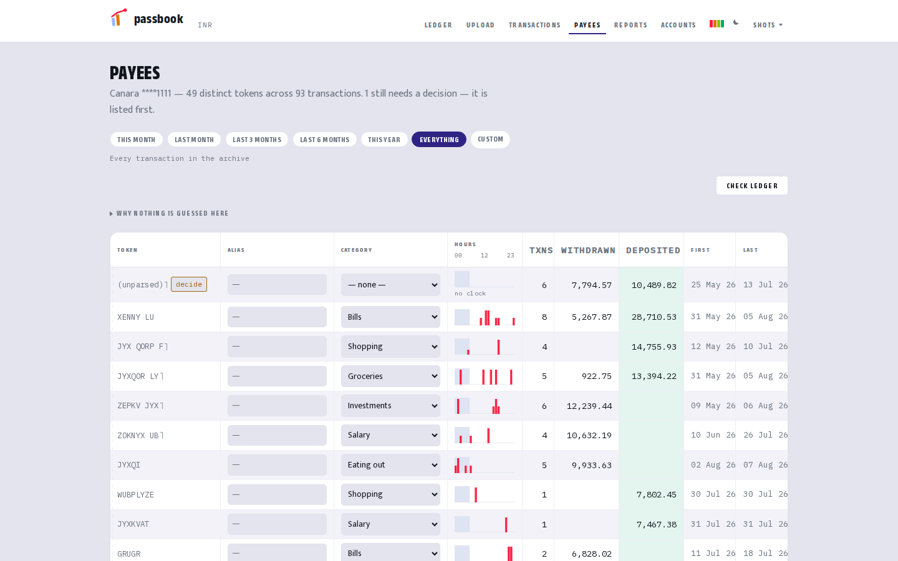

# What is this?

[← Back to the front page](../README.md) · [Set it up](SETUP.md) · [Using it](usage.md)

**passbook turns your bank statement into a picture of your spending.**

It runs on your own computer. Your statement never leaves it. There is no
account to sign up for, no company holding your data, and no monthly fee.

---

## Why not just look at the bank app?

Your bank shows you money going out. It does not know which of it was
*spending*.

Moving money into your own savings leaves your account, so the bank counts it.
A friend paying you back arrives, so the bank counts that as income. Neither is
true, and once a month has a few of each, the number you see is not your
spending — it is just movement.

passbook separates the two. And it shows you what it left out, so you can
disagree with it.

---

## How you use it

**Once a week, five minutes.**

### 1. Download your statement

From your bank's website or app, the same file you would download anyway.

### 2. Drop it on the Upload page

If your bank locks the file with a password, it asks for the password here.

It reads the file and **checks the bank's own arithmetic** — every balance, line
by line. If anything does not add up it stops and tells you, rather than saving
something wrong.

Nothing is saved until you look at what it found and press the button.

### 3. Look at where the money went

Your balance, what you actually spent, what you actually earned, and the
categories underneath.

### 4. Name people once

Banks write payees as things like `UPI/9876543210/...`. Give that a name once —
"Mess", "Mum" — and it stays named, including on everything already there.

That is the whole routine. Everything else is looking at it.

---

## What you see

| | |
|---|---|
| **Ledger** | your balance, spending, earnings, and where it went |
| **Transactions** | every row, searchable |
| **Reports** | by category, by person, over time |
| **Payees** | names and categories |
| **Accounts** | more than one bank account, together or apart |
| **Activity** | what changed, and when |
| **Status** | is everything healthy |

---

## Questions people ask

**Is my data sent anywhere?** No. It runs on your computer and talks to nothing
outside it.

**Do I need to know how to code?** No. You run one installer once. After that
everything is clicking in a browser.

**Which banks?** Canara, SBI and Union Bank are read out of the box. For
another bank, [say which one](https://github.com/shubh-garg18/passbook/issues)
and it can be added.

**Can it connect to my bank automatically?** No, and nor can anything else you
can run yourself — in India that access is closed to individuals. Downloading
the file yourself is the cost of not handing your login to somebody.

**What if I stop using it?** Everything is on your machine. Delete the folder.

---

**Ready?** → **[Set it up](SETUP.md)**
